# STL10-Labeled 

Please consider sponsoring this repo so that we can continue to develop high-quality datasets for the ML/AI research.

To become a sponsor:

[GitHub Sponsors](https://github.com/sponsors/semihyagli) <br/>
[Buy me a coffee](https://buymeacoffee.com/semihyagli) <br/>

You can also sponsor us by downloading our free application, **_Etiqueta_**, to your devices:

[Etiqueta on iOS or Apple Chip Macs](https://apps.apple.com/us/app/etiqueta/id6504646776) <br/>
[Etiqueta on Android](https://play.google.com/store/apps/details?id=com.aidatalabel.etiqueta) <br/>


This public repo contains labels for the unlabeled pictures in the stl10 dataset. <br/>
More information on the original STL-10 dataset can be found here: https://cs.stanford.edu/~acoates/stl10/ <br/>
Thanks to Martin Tutek, the original STL-10 dataset can be downloaded via the python code here: https://github.com/mttk/STL10

If you use this dataset in your research please do not forget to cite: <br/>

```
@techreport{yagli2025etiqueta,
  author      = {Semih Yagli},
  title       = {Etiqueta: AI-Aided, Gamified Data Labeling to Label and Segment Data},
  year        = {2025},
  number      = {TR-2025-0001},
  address     = {NJ, USA},
  month       = Apr.,
  url         = {https://www.aidatalabel.com/technical_reports/aidatalabel_tr_2025_0001.pdf},
  institution = {AI Data Label},
}
```
```
@inproceedings{coates2011analysis,
  title     = {An analysis of single-layer networks in unsupervised feature learning},
  author    = {Coates, Adam and Ng, Andrew and Lee, Honglak},
  booktitle = {Proceedings of the fourteenth international conference on artificial intelligence and statistics},
  pages     = {215--223},
  year      = {2011},
  organization={JMLR Workshop and Conference Proceedings}
}
```

Note: If you notice any errors and/or if you have comments/ideas relevant to this dataset or Etiqueta in general, please reach me out at [contact@aidatalabel.com](mailto:contact@aidatalabel.com).

## Instructions 
To download the dataset, run:
```
python stl10
```
1. This will create a folder named `data` download and extract the stl10 dataset inside that folder. 
2. Then it will show one example picture in a new window.
3. Once you close this example picture, images will then be saved to disk under a folder called `img`

If you just want to load images as `numpy.array`:
```
import stl10
images = read_all_images(DATA_PATH_TO_BINARY_FILE)
```
where by default `DATA_PATH_TO_BINARY_FILE` can be either of the following: <br/>
* `./data/stl10_binary/test_X.bin`
* `./data/stl10_binary/train_X.bin`
* `./data/stl10_binary/unlabeled_X.bin`

This repo specifically contains the labels for the images inside `unlabeled_X.bin`


## Examples

Class |  ai0 - passenger plane |  ai1 - small plane |  ai2 - sea plane |  ai3 - military plane |  ai4 - toy plane |  ai5 - helicopter |  
--- | --- | --- | --- | --- | --- | --- | 
airplane |  |  |  |  |  | 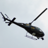 |

Class | ai6 - hot air balloon | ai7 - zeppelin | ai8 - spaceship | ai9 - other balloon | ai10 - kite | 
--- | --- | --- | --- | --- | --- | 
airplane |  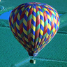 | 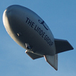 | 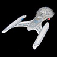 |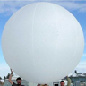 |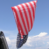 |

Class | an0 - antelope | an1 - wildebeest | an2 - oryx | an3 - dikdik | an4 - eland | an5 - kudu | 
--- | --- | --- | --- | --- | --- | --- | 
antelope |  | 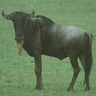 | 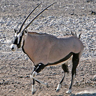 | 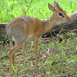 | 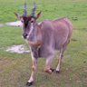 | 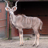 | 

Class | an6 - gerenuk | an7 - springbok | an8 - hartebeest | an9 - waterbuck | an10 - blackbuck | an11 - gazelle | 
--- | --- | --- | --- | --- | --- | --- | 
antelope | 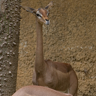 | 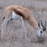 | 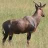 | 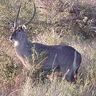 | 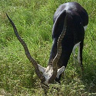 | 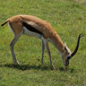 | 

Class | an12 - impala | an13 - saiga | an14 - addax | an15 - kob | an16 - topi | 
--- | --- | --- | --- | --- | --- |
antelope | 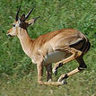 | 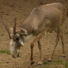 | 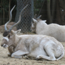 | 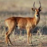 | 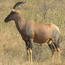 | 

Class | be0 - black bear | be1 - brown bear | be2 - polar bear | be3 - panda bear | be4 - red panda | 
--- | --- | --- | --- | --- | --- | 
bear | 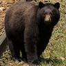 |  | 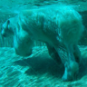 | 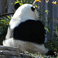 | 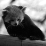 | 

Class | bi0 - bird | bi1 - chicken | bi2 - duck | 
--- | --- | --- | --- | 
bird | 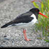 | 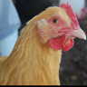 | 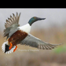 | 

Class | cam0 - camel | cam1 - lama/alpaca | 
--- | --- | --- | 
camelid | 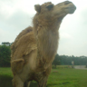 | 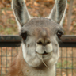 | 

Class | ca0 - dog | ca1 - fox | ca2 - wolf | ca3 - coyote | ca4 - jackal | ca5 - maned wolf | ca6 - dog sled
--- | --- | --- | --- | --- | --- | --- | --- |
canine | 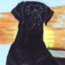 | 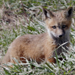 |  | 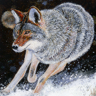 | 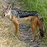 |  | 

Class | car0 - horse carriage | car1 - cattle carriage | car2 - human carriage | car3 - donkey carriage | car4 - goat carriage | car5 - other carriage | 
--- | --- | --- | --- | --- | --- | --- | 
carriage | 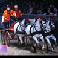 | 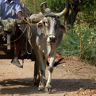 | 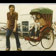 | 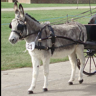 | 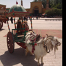 | 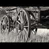 | 

Class | cy0 - motorcycle | cy1 - monocycle | cy2 - bicycle | cy3 - tricycle | cy4 - snowmobile | cy5 - skateboard | cy6 - scooter | 
--- | --- | --- | --- | --- | --- | --- | --- | 
cycle |  | 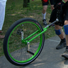 | 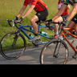 | 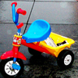 | 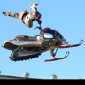 |  | 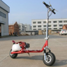 | 

Class | eq0 - horse | eq1 - donkey | eq2 - onager | eq3 - zorse | eq4 - zebra | eq5 - okapi | 
--- | --- | --- | --- | --- | --- | --- | 
equine | 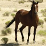 | 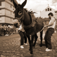 | 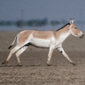 | 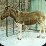 |  |  | 

Class | fe0 - cat | fe1 - lion | fe2 - tiger | fe3 - leopard | fe4 - hyena | fe5 - meerkat | 
--- | --- | --- | --- | --- | --- | --- | 
feline |  |  |  |  |  |  | 

Class | fe6 - fossa | fe7 - caracal | fe8 - lynx | fe9 - bearcat | fe10 - jaguar | 
--- | --- | --- | --- | --- | --- | 
feline |  |  |  |  |  | 

Class | fe11 - cougar | fe12 - civet | fe13 - mongoose | fe14 - genet | fe15 - kusimanse | 
--- | --- | --- | --- | --- | --- | 
feline |  |  |  |  |  | 

Class | mac0 - tractor | mac1 - excavator | mac2 - rolling compactor | mac3 - full-track tank | mac4 - half-track car | mac5 - forklift | mac6 - rocket | 
--- | --- | --- | --- | --- | --- | --- | --- | 
machinery |  |  |  |  |  |  |  | 

Class | mm0 - dolphin | mm1 - whale | mm2 - narwhal | mm3 - vaquita | 
--- | --- | --- | --- | --- | 
marine mammals |  |  |  |  | 

Class | mm4 - dugong/manatee | mm5 - seal/sea lion | mm6 - walrus | mm7 - porpoise | 
--- | --- | --- | --- | --- | 
marine mammals |  |  |  |  | 

Class | mu0 - badger | mu1 - weasel/stoat | mu2 - polecat | mu3 - ferret | mu4 - mink | mu5 - wolverine | 
--- | --- | --- | --- | --- | --- | --- | 
mustelinae |  |  |  |  |  |  | 

Class | mu6 - tayra | mu7 - skunk | mu8 - otter | mu9 - marten | mu10 - fisher | 
--- | --- | --- | --- | --- | --- | 
mustelinae |  |  |  |  |  | 

Class | pri0 - monkey | pri1 - nightmonkey | pri2 - lemur | pri3 - tarsier | pri4 - gorilla | pri5 - mandrill | pri6 - orangutan |
--- | --- | --- | --- | --- | --- | --- | --- |
primate |  |  |  |  |  |  |  | 

Class | pri7 - proboscis | pri8 - tamarin | pri9 - colobus | pri10 - ape | pri11 - marmoset | pri12 - colugo |
--- | --- | --- | --- | --- | --- | --- |
primate |  |  |  |  |  |  |

Class | pr0 - raccoon | pr1 - ringtail | pr2 - coati | pr3 - kinkajou | pr4 - olinguito |
--- | --- | --- | --- | --- | --- | 
procyonid |  |  |  |  |  | 

Class |  re0 - snake |  re1 - turtle |  re2 - sea turtle |  re3 - lizard |  re4 - frilled-neck lizard |  
--- | --- | --- | --- | --- | --- | 
reptile |   |   |   |   |   |  

Class |  re5 - monitor lizard |  re6 - chameleon |  re7 - aligator |  re8 - iguana |  re9 - gila monster |  
--- | --- | --- | --- | --- | --- | 
reptile |  |  |  |  |  | 

Class |  ro0 - mouse |  ro1 - rat |  ro2 - hamster |  ro3 - guinea pig |  ro4 - squirrel |  ro5 - rabbit |  
--- | --- | --- | --- | --- | --- | --- | 
rodent |  |  |  |  |  |  | 

Class |  ro6 - pika |  ro7 - vole |  ro8 - mouse-deer |  ro9 - agouti |  ro10 - jerboa |  ro11 - marmot |  
--- | --- | --- | --- | --- | --- | --- | 
rodent |  |  |  |  |  |  | 

Class |  ro12 - nutria |  ro13 - chinchilla |  ro14 - shrew |  ro15 - paca |  ro16 - lemming |  ro17 - hedgehog |  
--- | --- | --- | --- | --- | --- | --- | 
rodent |  |  |  |  |  |  | 

Class | ru0 - deer | ru1 - pronghorn | ru2 - cattle | ru3 - sheep | ru4 - goat | 
--- | --- | --- | --- | --- | --- |
ruminant |  |  |  |  |  | 

Class | ru5 - markhor | ru6 - giraffe | ru7 - takin | ru8 - serow | ru9 - goral |
--- | --- | --- | --- | --- | --- |
ruminant |  |  |  |  |  |

Class | sw0 - pig | sw1 - boar/peccary | sw2 - warthog | sw3 - babirusa | 
--- | --- | --- | --- | --- | 
swine |  |  |  |  | 

Class | tr0 - train | tr1 - tram | 
--- | --- | --- | 
train |  |  | 

Class | tru0 - truck-general | tru1 - truck bobtail | tru2 - freight truck | tru3 - gravel truck | tru4 - small-box truck | tru5 - mini truck | 
--- | --- | --- | --- | --- | --- | --- | 
truck |  |  |  |  |  |  | 

Class | tru6 - pickup truck | tru7 - car carrier/trailer | tru8 - garbage truck | tru9 - firetruck | tru10 - tow truck | tru11 - snowplow | 
--- | --- | --- | --- | --- | --- | --- | 
truck |  |  |  |  |  |  | 

Class | ut0 - shopping cart | ut1 - dolly | ut2 - wheel barrow | ut3 - buffet trolley | 
--- | --- | --- | --- | --- | 
utility |  |  |  |  | 

Class | ut4 - laundry cart | ut5 - stroller | ut6 - other utility | ut7 - sleigh | 
--- | --- | --- | --- | --- | 
utility |  |  |  |  | 

Class | ve0 - car | ve1 - limo | ve2 - golf-cart | ve3 - 4x4 | ve4 - bus | ve5 - minibus |  ve6 - minivan |
--- | --- | --- | --- | --- | --- | --- | --- | 
vehicle |  |  |  |  |  |  |  |

Class | ve7 - van | ve8 - caravan | ve9 - bumper car | ve10 - go-kart | ve11 - amphibious | ve12 - soapbox car | ve13 - mini caravan | 
--- | --- | --- | --- | --- | --- | --- | --- | 
vehicle |  |  |  |  |  |  |  | 

Class | wa0 - wooden boat | wa1 - jet boat | wa2 - catamaran boat | wa3 - yacht | wa4 - jetski | 
--- | --- | --- | --- | --- | --- |
watercraft |  |  |  |  |  | 

Class | wa5 - sail boat | wa6 - other boat | wa7 - sail ship | wa8 - cruise ship | 
--- | --- | --- | --- | --- |
watercraft |  |  |  |  | 

Class | wa9 - military ship | wa10 - cargo ship | wa11 - other ship | wa12 - submarine | 
--- | --- | --- | --- | --- |
watercraft |  |  |  |  | 

Class | om0 - bat | om1 - elephant | om2 - hyrax | om3 - hippo | om4 - rhino | om5 - tapir | om6 - anteater | 
--- | --- | --- | --- | --- | --- | --- | --- | 
other mammals |  |  |  |  |  |  |  | 

Class | om7 - armadillo | om8 - pangolin | om9 - aardvark | om10 - tasmanian devil | om11 - sloth | om12 - cuscus | om13 - possum | 
--- | --- | --- | --- | --- | --- | --- | --- | 
other mammals |  |  |  |  |  |  |  | 

Class | ou0 - restaurant | ou1 - human | ou2 - multiple subject | ou3 - unknown animal | ou4 - unclear picture | ou5 - skull | 
--- | --- | --- | --- | --- | --- | --- | 
outlier |  |  |  |  |  |  | 

Class |  ou6 - moth |  ou7 - car-interior |  ou8 - train-interior |  ou9 - ship-interior |  ou10 - japanese giant salamander |  ou11 - tambaqui fish |  
--- | --- | --- | --- | --- | --- | --- | 
outlier |  |  |  |  |  |  | 

Class | ou12 - seahorse | ou13 - frog | ou14 - kangaroo | ou15 - mantis | 
--- | --- | --- | --- | --- | 
outlier |  |  |  |  | 

## Notes - For future Relases
`mouse` in 0-35k needs to be redone <br/>
`rat` in 0-35k --> separate chincilla (needs to be redone) <br/>
`cat` in 0-35k --> separate civet and genet <br/>
`rocket` separate two types of rocket into mchinery and aircraft... <br/>
`mm1` separate orca from whales <br/>
`sw1` separate peccaries <br/>
`ve12` separate bobsled and soap box car <br/>
`wa6` tugboat can be separated, also check for yacht <br/>