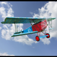
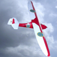

# STL Unlabeled 

Please consider sponsoring this repo so that we can continue to develop high-quality datasets for the ML/AI research.

To become a sponsor:

[GitHub Sponsors](https://github.com/sponsors/semihyagli)  
[Buy me a coffee](https://buymeacoffee.com/semihyagli)  

You can also sponsor us by downloading our free application, **_Etiqueta_**, to your devices:

[Etiqueta on iOS or Apple Chip Macs](https://apps.apple.com/us/app/etiqueta/id6504646776)  
[Etiqueta on Android](https://play.google.com/store/apps/details?id=com.aidatalabel.etiqueta)  

This public repo contains labels for the unlabeled pictures in the stl10 dataset. 
More information on the original stl10 dataset can be found here: https://cs.stanford.edu/~acoates/stl10/ 
Thanks to Martin Tutek, dataset can be downloaded via the python code here: https://github.com/mttk/STL10

## Examples

Class | ai0 - passenger plane | ai1 - small plane | ai2 - sea plane | ai3 - military plane | ai4 - toy plane | ai5 - helicopter | ai6 - balloon | ai7 - zeppelin | 
--- | --- | --- | --- | --- | --- | --- | --- | --- | 
airplane |  |  |  |  |  |  |  |  | 

Class  | ca0 - dog | ca1 - fox | ca2 - wolf | ca3 - coyote | ca4 - jackal | ca5 - maned wolf |
--- | --- | --- | --- | --- | --- | --- |
canine |  |  |  |  |  |  |

