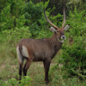
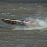

# STL10-Labeled 

Please consider sponsoring this repo so that we can continue to develop high-quality datasets for the ML/AI research.

To become a sponsor:

[GitHub Sponsors](https://github.com/sponsors/semihyagli) <br/>
[Buy me a coffee](https://buymeacoffee.com/semihyagli) <br/>

You can also sponsor us by downloading our free application, **_Etiqueta_**, to your devices:

[Etiqueta on iOS or Apple Chip Macs](https://apps.apple.com/us/app/etiqueta/id6504646776) <br/>
[Etiqueta on Android](https://play.google.com/store/apps/details?id=com.aidatalabel.etiqueta) <br/>


This public repo contains labels for the unlabeled pictures in the stl10 dataset. <br/>
More information on the original STL-10 dataset can be found here: https://cs.stanford.edu/~acoates/stl10/ <br/>
Thanks to Martin Tutek, the original STL-10 dataset can be downloaded via the python code here: https://github.com/mttk/STL10

If you use this dataset in your research please do not forget to cite: <br/>

```
@techreport{yagli2025etiqueta,
  author      = {Semih Yagli},
  title       = {Etiqueta: AI-Aided, Gamified Data Labeling to Label and Segment Data},
  year        = {2025},
  number      = {TR-2025-0001},
  address     = {NJ, USA},
  month       = Apr.,
  url         = {https://www.aidatalabel.com/technical_reports/aidatalabel_tr_2025_0001.pdf},
  institution = {AI Data Label},
}
```
```
@inproceedings{coates2011analysis,
  title     = {An analysis of single-layer networks in unsupervised feature learning},
  author    = {Coates, Adam and Ng, Andrew and Lee, Honglak},
  booktitle = {Proceedings of the fourteenth international conference on artificial intelligence and statistics},
  pages     = {215--223},
  year      = {2011},
  organization={JMLR Workshop and Conference Proceedings}
}
```

Note: If you notice any errors and/or if you have comments/ideas relevant to this dataset or Etiqueta in general, please reach me out at [contact@aidatalabel.com](mailto:contact@aidatalabel.com).

## Instructions 
To download the dataset, run:
```
python stl10
```
1. This will create a folder named `data` download and extract the stl10 dataset inside that folder. 
2. Then it will show one example picture in a new window.
3. Once you close this example picture, images will then be saved to disk under a folder called `img`

If you just want to load images as `numpy.array`:
```
import stl10
images = read_all_images(DATA_PATH_TO_BINARY_FILE)
```
where by default `DATA_PATH_TO_BINARY_FILE` can be either of the following: <br/>
* `./data/stl10_binary/test_X.bin`
* `./data/stl10_binary/train_X.bin`
* `./data/stl10_binary/unlabeled_X.bin`

This repo specifically contains the labels for the images inside `unlabeled_X.bin`


## Examples

Class |  ai0 - passenger plane |  ai1 - small plane |  ai2 - sea plane |  ai3 - military plane |  ai4 - toy plane |  ai5 - helicopter |  
--- | --- | --- | --- | --- | --- | --- | 
airplane |  |  |  |  |  |  |

Class | ai6 - hot air balloon | ai7 - zeppelin | ai8 - spaceship | ai9 - other balloon | ai10 - kite | 
--- | --- | --- | --- | --- | --- | 
airplane |   |  |  | | |

Class | an0 - antelope | an1 - wildebeest | an2 - oryx | an3 - dikdik | an4 - eland | an5 - kudu | 
--- | --- | --- | --- | --- | --- | --- | 
antelope |  |  |  |  |  |  | 

Class | an6 - gerenuk | an7 - springbok | an8 - hartebeest | an9 - waterbuck | an10 - blackbuck | an11 - gazelle | 
--- | --- | --- | --- | --- | --- | --- | 
antelope |  |  |  |  |  |  | 

Class | an12 - impala | an13 - saiga | an14 - addax | an15 - kob | an16 - topi | 
--- | --- | --- | --- | --- | --- |
antelope |  |  |  |  |  | 

Class | be0 - black bear | be1 - brown bear | be2 - polar bear | be3 - panda bear | be4 - red panda | 
--- | --- | --- | --- | --- | --- | 
bear |  |  |  |  |  | 

Class | bi0 - bird | bi1 - chicken | bi2 - duck | 
--- | --- | --- | --- | 
bird |  |  |  | 

Class | cam0 - camel | cam1 - lama/alpaca | 
--- | --- | --- | 
camelid |  |  | 

Class | ca0 - dog | ca1 - fox | ca2 - wolf | ca3 - coyote | ca4 - jackal | ca5 - maned wolf | ca6 - dog sled
--- | --- | --- | --- | --- | --- | --- | --- |
canine |  |  |  |  |  |  | 

Class | car0 - horse carriage | car1 - cattle carriage | car2 - human carriage | car3 - donkey carriage | car4 - goat carriage | car5 - other carriage | 
--- | --- | --- | --- | --- | --- | --- | 
carriage |  |  |  |  |  |  | 

Class | cy0 - motorcycle | cy1 - monocycle | cy2 - bicycle | cy3 - tricycle | cy4 - snowmobile | cy5 - skateboard | cy6 - scooter | 
--- | --- | --- | --- | --- | --- | --- | --- | 
cycle |  |  |  |  |  |  |  | 

Class | eq0 - horse | eq1 - donkey | eq2 - onager | eq3 - zorse | eq4 - zebra | eq5 - okapi | 
--- | --- | --- | --- | --- | --- | --- | 
equine |  |  |  |  |  |  | 

Class | fe0 - cat | fe1 - lion | fe2 - tiger | fe3 - leopard | fe4 - hyena | fe5 - meerkat | 
--- | --- | --- | --- | --- | --- | --- | 
feline |  |  |  |  |  |  | 

Class | fe6 - fossa | fe7 - caracal | fe8 - lynx | fe9 - bearcat | fe10 - jaguar | 
--- | --- | --- | --- | --- | --- | 
feline |  |  |  |  |  | 

Class | fe11 - cougar | fe12 - civet | fe13 - mongoose | fe14 - genet | fe15 - kusimanse | 
--- | --- | --- | --- | --- | --- | 
feline |  |  |  |  |  | 

Class | pri0 - monkey | pri1 - nightmonkey | pri2 - lemur | pri3 - tarsier | pri4 - gorilla | pri5 - mandrill |
--- | --- | --- | --- | --- | --- | --- |
primate |  |  |  |  |  |  |

Class | pri6 - orangutan | pri7 - proboscis | pri8 - tamarin | pri9 - colobus | pri10 - ape | pri11 - marmoset | pri12 - colugo |
--- | --- | --- | --- | --- | --- | --- | --- |
primate |  |  |  |  |  |  |  |

Class |  re0 - snake |  re1 - turtle |  re2 - sea turtle |  re3 - lizard |  re4 - frilled-neck lizard |  
--- | --- | --- | --- | --- | --- | 
reptile |   |   |   |   |   |  


Class |  re5 - monitor lizard |  re6 - chameleon |  re7 - aligator |  re8 - iguana |  re9 - gila monster |  
--- | --- | --- | --- | --- | --- | 
reptile |  |  |  |  |  | 


Class | ru0 - deer | ru1 - pronghorn | ru2 - cattle | ru3 - sheep | ru4 - goat | 
--- | --- | --- | --- | --- | --- |
ruminant |  |  |  |  |  | 

Class | ru5 - markhor | ru6 - giraffe | ru7 - takin | ru8 - serow | 
--- | --- | --- | --- | --- |
ruminant |  |  |  | 


Class | tr0 - train | tr1 - tram | 
--- | --- | --- | 
train |  |  | 

Class | ve0 - car | ve1 - limo | ve2 - golf-cart | ve3 - jeep | ve4 - bus | ve5 - minibus 
--- | --- | --- | --- | --- | --- | --- |
vehicle |  |  |  |  |  |  |

Class | ve6 - minivan | ve7 - van | ve8 - caravan | ve9 - ambulance_van | ve10 - ambulance_truck |
--- | --- | --- | --- | --- | --- |
vehicle |  |  |  |  |  |

Class | ve11 - garbage truck | ve12 - firetruck | ve13 - car carrier trailer | ve14 - freight truck | ve15 - gravel truck |
--- | --- | --- | --- | --- | --- |
vehicle |  |  |  |  |  |

Class | ve16 - mini truck | ve17 - pickup truck | ve18 - tractor | ve19 - excavator | ve20 - rolling compactor |
--- | --- | --- | --- | --- | --- |
vehicle |  |  |  |  |  |

Class | ve21 - full-track tank | ve22 - half-track car | ve23 - bumper car | ve24 - go-kart | ve25 - amphibious car | ve26 - soapbox car |
--- | --- | --- | --- | --- | --- | --- |
vehicle |  |  |  |  |  |  |


Class | wa0 - wooden boat | wa1 - jet boat | wa2 - catamaran boat | wa3 - yacht | wa4 - jetski | 
--- | --- | --- | --- | --- | --- |
watercraft |  |  |  |  |  | 

Class | wa5 - sail boat | wa6 - other boat | wa7 - sail ship | wa8 - cruise ship | 
--- | --- | --- | --- | --- |
watercraft |  |  |  |  | 

Class | wa9 - military ship | wa10 - cargo ship | wa11 - other ship | wa12 - submarine | 
--- | --- | --- | --- | --- |
watercraft |  |  |  |  | 


`antelope` in 0-55k will be redone <br/>
`rat` in 0-35k --> separate chincilla <br/>
`cat` in 0-35k --> separate civet  and genet <br/>
`cougar` --> may be moved to lion, because of lack of clarity <br/>
`fe15` until 75k, there should only be 1.
