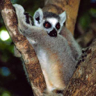

# STL Unlabeled 

Please consider sponsoring this repo so that we can continue to develop high-quality datasets for the ML/AI research.

To become a sponsor:

[GitHub Sponsors](https://github.com/sponsors/semihyagli)  
[Buy me a coffee](https://buymeacoffee.com/semihyagli)  

You can also sponsor us by downloading our free application, **_Etiqueta_**, to your devices:

[Etiqueta on iOS or Apple Chip Macs](https://apps.apple.com/us/app/etiqueta/id6504646776)  
[Etiqueta on Android](https://play.google.com/store/apps/details?id=com.aidatalabel.etiqueta)  

This public repo contains labels for the unlabeled pictures in the stl10 dataset.  
More information on the original stl10 dataset can be found here: https://cs.stanford.edu/~acoates/stl10/  
Thanks to Martin Tutek, dataset can be downloaded via the python code here: https://github.com/mttk/STL10

## Examples

Class | ai0 - passenger plane | ai1 - small plane | ai2 - sea plane | ai3 - military plane | ai4 - toy plane | ai5 - helicopter | ai6 - balloon | ai7 - zeppelin | 
--- | --- | --- | --- | --- | --- | --- | --- | --- | 
airplane |  |  |  |  |  |  |  |  | 

Class  | ca0 - dog | ca1 - fox | ca2 - wolf | ca3 - coyote | ca4 - jackal | ca5 - maned wolf | ca6 - dog sled
--- | --- | --- | --- | --- | --- | --- | --- |
canine |  |  |  |  |  |  | 

Class | eq0 - horse | eq1 - donkey | eq2 - onager | eq3 - zorse |
--- | --- | --- | --- | --- | 
equine |  |  |  |  | 

Class | fe0 - cat | fe1 - lion | fe2 - tiger | fe3 - leopard | fe4 - hyena | fe5 - meerkat | 
--- | --- | --- | --- | --- | --- | --- |
feline |  |  |  |  |  |   |

Class | fe6 - fossa | fe7 - caracal | fe8 - lynx | fe9 - manul | fe10 - jaguar | fe11 - cougar | 
--- | --- | --- | --- | --- | --- | --- | 
feline |  |  |  |  |  |  | 

Class | pri0 - monkey | pri1 - nightmonkey | pri2 - lemur | pri3 - tarsier | pri4 - gorilla | pri5 - mandrill |
--- | --- | --- | --- | --- | --- | --- |
primate |  |  |  |  |  |  |

Class | pri6 - orangutan | pri7 - proboscis | pri8 - tamarin | pri9 - colobus | pri10 - ape | pri11 - marmoset
--- | --- | --- | --- | --- | --- | --- |
primate |  |  |  |  |  |  |

Class | ve0 - car | ve1 - limo | ve2 - golf-cart | ve3 - jeep | ve4 - bus | ve5 - minibus 
--- | --- | --- | --- | --- | --- | --- |
vehicle |  |  |  |  |  |  |

Class | ve6 - minivan | ve7 - van | ve8 - caravan | ve9 - ambulance_van | ve10 - ambulance_truck |
--- | --- | --- | --- | --- | --- |
vehicle |  |  |  |  |  |

Class | ve11 - garbage truck | ve12 - firetruck | ve13 - car carrier trailer | ve14 - freight truck | ve15 - gravel truck |
--- | --- | --- | --- | --- | --- |
vehicle |  |  |  |  |  |

Class | ve16 - mini truck | ve17 - pickup truck | ve18 - tractor | ve19 - excavator | ve20 - rolling compactor |
--- | --- | --- | --- | --- | --- |
vehicle |  |  |  |  |  |

Class | ve21 - full-track tank | ve22 - half-track car | ve23 - bumper car | ve24 - go-kart | ve25 - amphibious car | ve26 - soapbox car |
--- | --- | --- | --- | --- | --- | --- |
vehicle |  |  |  |  |  |  |

